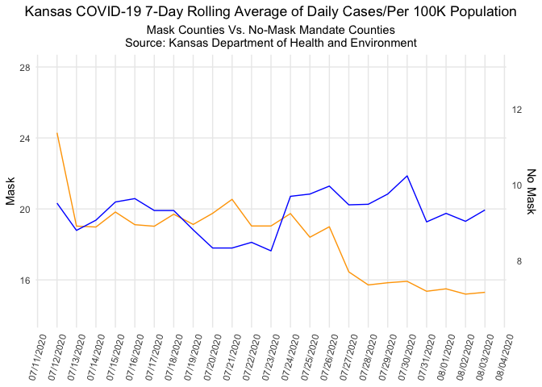
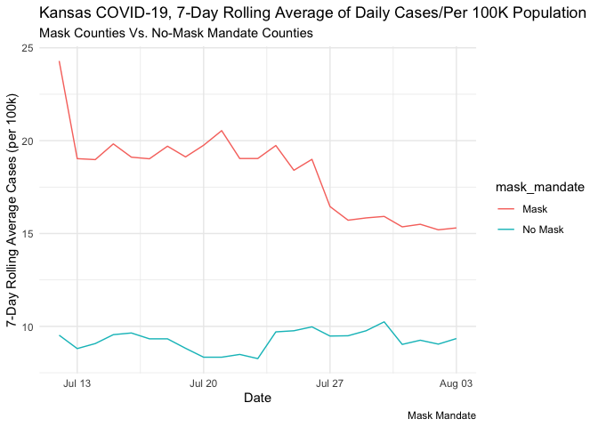
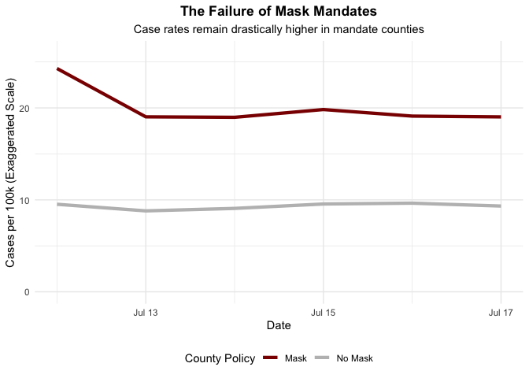

Lab 07 - Conveying the right message through visualisation
================
Barbara Mu
02/27/2026

### Load packages and data

``` r
library(tidyverse) 
library(ggplot2)
```

### Exercise 1

``` r
df <- read_csv("~/Documents/GitHub/Lab-07/kansas_grouped_rolling_avg.csv")
```

    ## Rows: 46 Columns: 3
    ## ── Column specification ────────────────────────────────────────────────────────
    ## Delimiter: ","
    ## chr  (1): mask_mandate
    ## dbl  (1): rolling_avg
    ## date (1): date
    ## 
    ## ℹ Use `spec()` to retrieve the full column specification for this data.
    ## ℹ Specify the column types or set `show_col_types = FALSE` to quiet this message.

``` r
masked <- df %>% filter(mask_mandate == "Mask")
unmasked <- df %>% filter(mask_mandate == "No Mask")


scale_factor <- max(masked$rolling_avg) / max(unmasked$rolling_avg) * 0.9

ggplot() +
  geom_line(data = masked, aes(x = date, y = rolling_avg), color = "orange") +
  geom_line(data = unmasked, aes(x = date, y = rolling_avg * scale_factor), color = "blue") +
  scale_y_continuous(
    name = "Mask",
    limits = c(14, 28),
    sec.axis = sec_axis(~ . / scale_factor, name = "No Mask", breaks = seq(4, 14, by = 2))
  ) +
  labs(
    title = "Kansas COVID-19 7-Day Rolling Average of Daily Cases/Per 100K Population",
    subtitle = "Mask Counties Vs. No-Mask Mandate Counties\nSource: Kansas Department of Health and Environment",
    x = NULL
  ) +
  scale_x_date(date_labels = "%m/%d/%Y", date_breaks = "1 day") +
  theme_minimal() +
  theme(
    plot.title = element_text(hjust = 0.5),     
    plot.subtitle = element_text(hjust = 0.5),   
    axis.text.x = element_text(angle = 75, vjust = 0.5),
    panel.grid.minor = element_blank()
  )
```

<!-- -->

### Exercise 2 and 3

``` r
ggplot(df, aes(x = date, y = rolling_avg, fill = mask_mandate, colour = mask_mandate)) +
  geom_line() + 
  labs(title = "Kansas COVID-19, 7-Day Rolling Average of Daily Cases/Per 100K Population", 
       subtitle = "Mask Counties Vs. No-Mask Mandate Counties", 
       x = "Date", 
       y = "7-Day Rolling Average Cases (per 100k)", 
       caption = "Mask Mandate") + 
  theme_minimal()
```

<!-- -->

The previous visualization gave a misleading comparison of wearing or
not wearing masks for preventing COVID-19 rolling. My visualization uses
the same scale for counties with Mask and No Mask mandate group, with
counties that implemented mandates had significantly higher starting
rates. From the plot, we can see wearing Mask is an effective way to
make us have a lower rate of rolling COVID-19, as the mask mandate
counties showed a clear downward trend.

### Exercise 4

The visualization can mainly tell us information from 3 aspects. First,
the counties that adopted mandates were likely those with the most
severe outbreaks initially. Second, it shows the trend that while mask
Mandate counties have a higher total number of cases, the slope of their
line indicates the mandate was associated with a decrease in the rate of
spread. Third, it shows a clear comparison: without the misleading
scale, we see a “convergence” where the mandate counties are
successfully bringing their numbers down toward the level of the
non-mandate counties (relatively flat line).

### Exercise 5

The visualization created in Exercise 2 conveys that while counties with
mask mandates initially had much higher COVID-19 case rates, those rates
declined significantly following the implementation of the mandate. In
contrast, counties without mandates saw their rates remain relatively
stable.

Several key factors contribute to this clarity. (1) We used unified
y-axis. Specifically, by using a single scale for both groups, the true
magnitude of the difference is visible. We can see that mask mandate
counties started near 25 cases/100k, while no mandate counties were
closer to 10. (2) We took zero as the baseline, in which start the axis
at zero prevents the exaggeration of small fluctuations. (3) Using a
single coordinate system allows the viewer to see the “convergence” of
the two lines, suggesting the mandates were effective in bringing
high-spread areas down to the level of low-spread areas.

### Exercise 6

The opposite message I want to convey is: *mask mandates are ineffective
because counties that adopted them had higher COVID-19 case rates than
counties that did not.*

The visualization’s key finding is the downward trend in mask counties
over time. To reverse that message, the most effective strategy is to
hide the trend entirely by cropping the time window to only the first
few days of the mandate period (July 12–17), before any decline had
begun. This leaves only the part of the data where mask counties are at
their peak and the gap between the two groups looks large and permanent.

This approach is more deceptive than manipulating the y-axis alone,
because a truncated time window is harder for a casual viewer to detect
— the x-axis still has labeled dates and looks complete. The data used
is real; the manipulation lies entirely in what is omitted.

### Exercise 7

``` r
early_df <- df %>% filter(date <= "2020-07-17")

ggplot(early_df, aes(x = date, y = rolling_avg, color = mask_mandate)) +
  geom_line(size = 1.5) +
  coord_cartesian(ylim = c(0, 26)) +
  scale_color_manual(values = c("Mask" = "darkred", "No Mask" = "gray")) +
  labs(
    title = "The Failure of Mask Mandates",
    subtitle = "Case rates remain drastically higher in mandate counties",
    x = "Date",
    y = "Cases per 100k (Exaggerated Scale)",
    color = "County Policy"
  ) +
  theme_minimal() +
  theme(
    plot.title = element_text(hjust = 0.5, face = "bold"),
    plot.subtitle = element_text(hjust = 0.5),
    legend.position = "bottom"
  )
```

    ## Warning: Using `size` aesthetic for lines was deprecated in ggplot2 3.4.0.
    ## ℹ Please use `linewidth` instead.
    ## This warning is displayed once every 8 hours.
    ## Call `lifecycle::last_lifecycle_warnings()` to see where this warning was
    ## generated.

<!-- -->

This visualization conveys the opposite message — that mask mandates are
ineffective — through three deliberate choices:

First, we used selective time window. By filtering to only July 12–17,
the chart cuts off before mask counties began their sustained decline.
The viewer never sees the downward trend that is the central honest
finding of the data. Cropping the time axis is one of the most powerful
and least obvious forms of chart manipulation, because the axes still
look “complete” to a casual reader.

Second, the Mask group was encoded in dark red to prime the viewer to
associate it with danger or failure, while gray for No-Mask reads as
neutral or safe. The title “The Failure of Mask Mandates” and subtitle
further anchor the interpretation before the viewer even reads the data.
These choices exploit the fact that audiences often absorb a chart’s
title and color cues before engaging with the actual values.

Thrid, starting at zero looks methodologically honest, but combined with
the narrow time window, the large and stable gap between the two lines
fills the chart and appears permanent. Without the later dates showing
convergence, there is no visual evidence that the gap was ever closing —
the opposite impression from the accurate visualization.

Together, these choices illustrate how cherry-picking the time range,
combined with suggestive color and framing, can produce a chart that is
technically based on real data yet fundamentally misleads the audience
about what the data actually shows.
